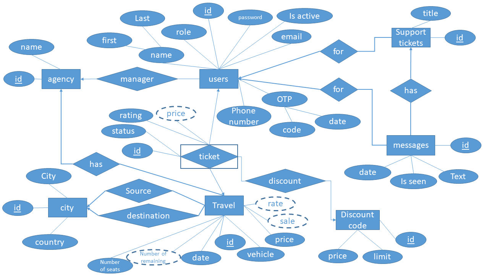

# Travel-Management-System-DB
This is a Database course project.

Authors: Amirhossein Ezzati, [Mehdi Vakili](@mehdivakili)

# Online Travel Ticket Purchasing Platform

## Introduction
Traveling allows us to explore new places, cultures, and perspectives. This project aims to design the database system of an online travel ticket purchasing platform that caters to both customers and travel agency managers. The platform offers convenience, flexibility, and ease of use in booking travel arrangements, providing users with a seamless experience in planning their trips.

## Travels
The platform offers three types of travel: Train, Bus, and Airplane. Air travel can be domestic or abroad. Each travel has the following information:
- Date and time
- Type of vehicle
- Price
- Number of available seats

The number of seats in each travel should be dynamically updated after any passenger interactions to ensure accurate availability.

## Users
The project supports three types of users with different roles:
1. Passengers: They can register and have their own panel with personal information. Passengers can reserve, order, and pay for tickets. They can also track the status of their orders and apply discounts using discount codes. Additionally, passengers can search for tickets with various parameters and filters and rate previous travels.
2. Travel Agency Manager: Managers can add new travels and filter travels associated with their agency based on different parameters. They have access to useful statistics such as bestselling travels, highest income, the highest rating, most popular destinations, and more. Managers can retrieve information on the top 5 customers with the highest total paid price for travels in a specific month.
3. Super Admin: Super admins can engage in chat conversations with customers and travel agency managers through the support system. They have access to the online support system's ticket creation and messaging features.

## Security
User registration involves a one-time password (OTP) process via SMS or email. OTPs have an expiration time and must be validated within that timeframe for account verification. Passwords should be securely stored to ensure database security and protect user information.

## Support System
The platform includes an online support system to enhance customer and travel agency manager interaction. Users can create support tickets to communicate queries, concerns, or requests. Messaging functionality allows users to send and receive messages within the support system, maintaining a clear conversation timeline. Optional features like message status indicators can be implemented to indicate if messages have been viewed.

## Database Schema and Functionality
The database schema includes tables for users, travels, tickets, orders, agencies, discounts, support tickets, vehicles, stations, and more. Stored procedures and functions are implemented to handle ticket reservation, ordering, payment, tracking, and support system functionalities.

## All of the constraints and features have been handled.

